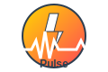

# Pulse 品牌指南

## 品牌概念

**Pulse** 是一个AI驱动的智能告警管理平台，以"脉搏"和"闪电"为核心设计元素，体现系统监控的实时性和响应的快速性。

## Logo设计理念

### 核心元素
- **⚡ 闪电**：代表快速响应、瞬间洞察、高效处理
- **▲▲▲ 脉搏波**：代表系统心跳、实时监控、生命力
- **圆形背景**：代表完整性、保护、统一管理

### 设计原则
1. **简洁性**：图标在任何尺寸下都清晰可辨
2. **识别性**：独特的闪电+脉搏组合，易于记忆
3. **适应性**：适用于各种媒介和背景色
4. **专业性**：体现企业级产品的可靠性

## 色彩规范

### 主色调
```css
/* 闪电黄 - 主要强调色 */
--pulse-yellow: #FFD700;

/* 脉搏红 - 告警和紧急状态 */
--pulse-red: #FF4757;

/* 深空蓝 - 主要文字和边框 */
--pulse-blue: #2C3E50;

/* 成功绿 - 正常状态和成功操作 */
--pulse-green: #2ECC71;

/* 中性灰 - 辅助文字和背景 */
--pulse-gray: #95A5A6;
```

### 渐变色
```css
/* 主渐变 - 用于按钮和重要元素 */
.pulse-gradient {
    background: linear-gradient(45deg, #FFD700 0%, #FF4757 100%);
}

/* 脉搏动画渐变 */
.pulse-animation {
    background: linear-gradient(90deg, #FF4757 0%, #FFD700 50%, #FF4757 100%);
    animation: pulse 2s ease-in-out infinite;
}
```

## 字体规范

### 主字体
- **英文**：Roboto, Arial, sans-serif
- **中文**：PingFang SC, Microsoft YaHei, sans-serif

### 字体层级
```css
/* 主标题 */
.pulse-title {
    font-size: 32px;
    font-weight: 700;
    color: var(--pulse-blue);
}

/* 副标题 */
.pulse-subtitle {
    font-size: 24px;
    font-weight: 600;
    color: var(--pulse-blue);
}

/* 正文 */
.pulse-body {
    font-size: 16px;
    font-weight: 400;
    color: var(--pulse-blue);
}

/* 小字 */
.pulse-caption {
    font-size: 14px;
    font-weight: 400;
    color: var(--pulse-gray);
}
```

## Logo使用规范

### 最小尺寸
- **数字媒体**：最小 24x24 像素
- **印刷媒体**：最小 12mm x 12mm

### 安全区域
Logo周围应保持等于Logo高度1/2的空白区域

### 禁用情况
❌ 不要拉伸或压缩Logo
❌ 不要改变Logo颜色比例
❌ 不要在复杂背景上使用Logo
❌ 不要添加阴影或特效

## 品牌标语

### 主标语
**中文**：感知每一次脉搏，响应每一个告警
**英文**：Feel Every Pulse, Handle Every Alert

### 使用场景
- 官网首页
- 产品介绍页面
- 营销材料
- 演示文稿

## 应用示例

### 网站Header
```html
<header class="pulse-header">
    <div class="pulse-logo">
        
        <span class="pulse-brand-name">Pulse</span>
    </div>
</header>
```

### 产品界面
```html
<div class="pulse-dashboard">
    <h1 class="pulse-title">⚡ 实时脉搏监控</h1>
    <div class="pulse-status">
        <span class="pulse-indicator">～～～▲▲▲～～～</span>
        <span class="pulse-text">系统心跳正常</span>
    </div>
</div>
```

### 移动端适配
- Logo在小屏幕上只显示图标部分
- 保持脉搏波动画效果
- 确保触摸区域足够大

## 动画效果

### 脉搏动画
```css
@keyframes pulse {
    0% { transform: scale(1); opacity: 1; }
    50% { transform: scale(1.1); opacity: 0.8; }
    100% { transform: scale(1); opacity: 1; }
}

.pulse-heartbeat {
    animation: pulse 1.5s ease-in-out infinite;
}
```

### 闪电效果
```css
@keyframes lightning {
    0% { opacity: 1; }
    50% { opacity: 0.3; }
    100% { opacity: 1; }
}

.pulse-lightning {
    animation: lightning 0.5s ease-in-out infinite;
}
```

## 品牌声音

### 语调特点
- **专业而友好**：技术准确但不冰冷
- **积极主动**：强调解决问题的能力
- **简洁明了**：避免复杂的技术术语
- **充满活力**：体现"脉搏"的生命力

### 常用词汇
- 脉搏、心跳、节拍
- 闪电、瞬间、快速
- 智能、洞察、预测
- 流畅、高效、可靠

## 文件资源

### Logo文件
- `logo.svg` - 矢量格式主Logo
- `logo-icon.svg` - 纯图标版本
- `logo-horizontal.svg` - 横版Logo
- `logo-white.svg` - 白色版本

### 使用建议
- 优先使用SVG格式保证清晰度
- 深色背景使用白色版本
- 小尺寸场景使用纯图标版本