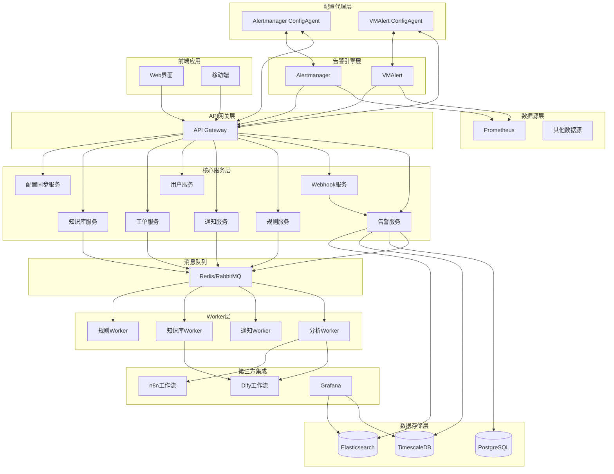

# 告警管理平台设计文档

## 概述

告警管理平台采用现代化的微服务架构，集成第三方工作流平台和可视化工具，提供企业级的告警管理能力。系统基于事件驱动架构设计，通过分布式Worker处理各种异步任务，确保高性能和可扩展性。

### 核心设计原则

- **微服务架构**：各功能模块独立部署和扩展
- **事件驱动**：基于消息队列的异步处理机制
- **插件化设计**：支持通知渠道和数据源的灵活扩展
- **第三方集成**：充分利用现有工具生态，避免重复开发
- **云原生**：支持容器化部署和Kubernetes编排

## 架构

### 系统架构图



### API网关功能

**API Gateway职责**：
- **流量控制**：限流、熔断、负载均衡
- **安全认证**：API Key、JWT Token验证
- **请求路由**：根据路径和规则转发请求
- **监控日志**：请求追踪、性能监控、访问日志
- **协议转换**：HTTP/HTTPS、WebSocket支持
- **缓存策略**：响应缓存、CDN集成

**网关配置示例**：
```yaml
# API Gateway配置
routes:
  # 告警相关API
  - path: "/api/v1/alerts/*"
    service: "alert-service"
    methods: ["GET", "POST", "PUT", "DELETE"]
    auth: "jwt"
    rate_limit: "1000/min"
    
  # Webhook接口
  - path: "/webhook/*"
    service: "webhook-service"
    methods: ["POST"]
    auth: "api_key"
    rate_limit: "10000/min"
    timeout: "30s"
    
  # 规则管理API
  - path: "/api/v1/rules/*"
    service: "rule-service"
    methods: ["GET", "POST", "PUT", "DELETE"]
    auth: "jwt"
    rate_limit: "500/min"
    
  # 配置同步API（供ConfigAgent使用）
  - path: "/api/v1/config/*/latest"
    service: "config-sync-service"
    methods: ["GET"]
    auth: "api_key"
    rate_limit: "100/min"
    timeout: "10s"
    description: "ConfigAgent获取最新配置"
    
  - path: "/api/v1/config/*/version/*"
    service: "config-sync-service"
    methods: ["GET", "POST"]
    auth: "api_key"
    rate_limit: "100/min"
    timeout: "10s"
    description: "ConfigAgent获取指定版本配置或标记已应用"
    
  - path: "/api/v1/config/*/agent/*"
    service: "config-sync-service"
    methods: ["GET", "POST"]
    auth: "api_key"
    rate_limit: "200/min"
    timeout: "5s"
    description: "ConfigAgent状态和错误上报"
    
  # 配置管理API（供Web界面使用）
  - path: "/api/v1/config/*/sync/*"
    service: "config-sync-service"
    methods: ["GET"]
    auth: "jwt"
    rate_limit: "100/min"
    timeout: "10s"
    description: "管理端查看同步状态"
    
  # 用户管理API
  - path: "/api/v1/users/*"
    service: "user-service"
    methods: ["GET", "POST", "PUT", "DELETE"]
    auth: "jwt"
    rate_limit: "200/min"
    
  # 工单管理API
  - path: "/api/v1/tickets/*"
    service: "ticket-service"
    methods: ["GET", "POST", "PUT", "DELETE"]
    auth: "jwt"
    rate_limit: "500/min"
    
  # 知识库API
  - path: "/api/v1/knowledge/*"
    service: "knowledge-service"
    methods: ["GET", "POST", "PUT", "DELETE"]
    auth: "jwt"
    rate_limit: "300/min"

# 认证配置
auth:
  jwt:
    secret: "${JWT_SECRET}"
    expire: "24h"
  api_key:
    header: "X-API-Key"
    sources:
      - config_agents
      - webhook_sources

middleware:
  - cors
  - request_id
  - access_log
  - metrics
  - circuit_breaker
  - rate_limiter
```

### 技术栈选择

**后端服务**
- **语言**: Go（高性能和并发优势）
- **框架**: Gin（轻量级Web框架）
- **数据库**: PostgreSQL（主数据库）+ TimescaleDB（时序数据）+ Elasticsearch（搜索）
- **消息队列**: Redis（轻量级）或RabbitMQ（企业级）
- **缓存**: Redis

**前端应用**
- **框架**: React 18 + TypeScript
- **UI组件**: Ant Design
- **状态管理**: Redux Toolkit + RTK Query
- **构建工具**: Vite

**基础设施**
- **容器化**: Docker + Kubernetes
- **服务网格**: Istio（可选）
- **监控**: Prometheus + Grafana
- **日志**: ELK Stack

## 组件和接口

### 核心服务组件

#### 1. Webhook服务 (Webhook Service)

**职责**：
- 接收外部系统的Webhook请求
- 解析不同格式的告警数据
- 数据标准化和验证
- 转发处理后的告警到告警服务

**主要接口**：
```go
type WebhookService interface {
    // 注册数据源适配器
    RegisterAdapter(source string, adapter WebhookAdapter) error
    
    // 处理Webhook请求
    HandleWebhook(ctx context.Context, source string, payload []byte) error
    
    // 获取支持的数据源
    GetSupportedSources() []string
    
    // 验证Webhook签名
    ValidateSignature(ctx context.Context, source string, signature string, payload []byte) error
}

type WebhookAdapter interface {
    // 数据源名称
    Name() string
    
    // 解析Webhook数据
    Parse(payload []byte) ([]*Alert, error)
    
    // 验证数据格式
    Validate(payload []byte) error
    
    // 支持的内容类型
    SupportedContentTypes() []string
}
```

#### 2. 告警服务 (Alert Service)

**职责**：
- 接收和解析外部告警数据
- 告警数据标准化和存储
- 告警状态管理和生命周期跟踪

**主要接口**：
```go
type AlertService interface {
    // 接收告警（来自Webhook服务或其他内部服务）
    ReceiveAlert(ctx context.Context, alert *Alert) error
    
    // 批量接收告警
    ReceiveAlerts(ctx context.Context, alerts []*Alert) error
    
    // 查询告警
    QueryAlerts(ctx context.Context, query *AlertQuery) (*AlertList, error)
    
    // 更新告警状态
    UpdateAlertStatus(ctx context.Context, alertID string, status AlertStatus) error
    
    // 获取告警详情
    GetAlertDetail(ctx context.Context, alertID string) (*AlertDetail, error)
    
    // 获取告警统计
    GetAlertStatistics(ctx context.Context, query *StatisticsQuery) (*AlertStatistics, error)
}
```

#### 2. 规则服务 (Rule Service)

**职责**：
- 告警规则配置和管理
- 规则引擎执行和匹配
- 规则验证和测试

**主要接口**：
```go
type RuleService interface {
    // 创建规则
    CreateRule(ctx context.Context, rule *Rule) error
    
    // 更新规则
    UpdateRule(ctx context.Context, ruleID string, rule *Rule) error
    
    // 执行规则匹配
    MatchRules(ctx context.Context, alert *Alert) ([]*Rule, error)
    
    // 验证规则
    ValidateRule(ctx context.Context, rule *Rule) error
}
```

#### 3. 通知服务 (Notification Service)

**职责**：
- 通知渠道插件管理
- 通知模板配置
- 通知发送和重试机制

**主要接口**：
```go
type NotificationService interface {
    // 发送通知
    SendNotification(ctx context.Context, notification *Notification) error
    
    // 注册通知插件
    RegisterPlugin(plugin NotificationPlugin) error
    
    // 获取可用插件
    GetAvailablePlugins() []PluginInfo
    
    // 配置通知模板
    ConfigureTemplate(ctx context.Context, template *NotificationTemplate) error
}

type NotificationPlugin interface {
    Name() string
    Send(ctx context.Context, message *Message) error
    Validate(config map[string]interface{}) error
}
```

#### 4. 工单服务 (Ticket Service)

**职责**：
- 工单创建和分配
- 工单状态跟踪
- 处理历史记录

**主要接口**：
```go
type TicketService interface {
    // 创建工单
    CreateTicket(ctx context.Context, ticket *Ticket) error
    
    // 分配工单
    AssignTicket(ctx context.Context, ticketID, assigneeID string) error
    
    // 更新工单状态
    UpdateTicketStatus(ctx context.Context, ticketID string, status TicketStatus) error
    
    // 添加处理记录
    AddProcessRecord(ctx context.Context, ticketID string, record *ProcessRecord) error
}
```

#### 5. 配置同步服务 (Config Sync Service)

**职责**：
- 告警规则转换和配置生成
- 配置版本管理和历史记录
- 配置变更通知和审计

**主要接口**：
```go
type ConfigSyncService interface {
    // 注册数据源适配器
    RegisterAdapter(source string, adapter ConfigAdapter) error
    
    // 生成外部系统配置
    GenerateConfig(ctx context.Context, source string, rules []*Rule) (*ConfigVersion, error)
    
    // 获取最新配置版本
    GetLatestConfig(ctx context.Context, source string) (*ConfigVersion, error)
    
    // 获取指定版本配置
    GetConfigByVersion(ctx context.Context, source string, version string) (*ConfigVersion, error)
    
    // 获取配置历史
    GetConfigHistory(ctx context.Context, source string, limit int) ([]*ConfigVersion, error)
    
    // 标记配置为已应用
    MarkConfigApplied(ctx context.Context, source string, version string) error
    
    // 获取同步状态
    GetSyncStatus(ctx context.Context, source string) (*SyncStatus, error)
}

// 配置适配器接口
type ConfigAdapter interface {
    // 数据源名称
    Name() string
    
    // 将平台规则转换为外部系统配置
    TransformRules(rules []*Rule) ([]byte, error)
    
    // 验证配置格式
    ValidateConfig(config []byte) error
    
    // 获取配置差异
    GetConfigDiff(oldConfig, newConfig []byte) (*ConfigDiff, error)
}

// 配置版本模型
type ConfigVersion struct {
    ID          string    `json:"id"`
    Source      string    `json:"source"`
    Version     string    `json:"version"`
    Config      []byte    `json:"config"`
    Checksum    string    `json:"checksum"`
    RuleCount   int       `json:"rule_count"`
    CreatedAt   time.Time `json:"created_at"`
    AppliedAt   *time.Time `json:"applied_at,omitempty"`
    Status      string    `json:"status"` // pending, applied, failed
}
```

**HTTP API接口**（通过API Gateway暴露给ConfigAgent）：
```go
// 配置API路由
func (s *ConfigSyncService) SetupRoutes(r *gin.Engine) {
    config := r.Group("/api/v1/config")
    {
        // ConfigAgent获取最新配置
        config.GET("/:source/latest", s.getLatestConfig)
        
        // ConfigAgent获取指定版本配置
        config.GET("/:source/version/:version", s.getConfigByVersion)
        
        // ConfigAgent获取配置历史
        config.GET("/:source/history", s.getConfigHistory)
        
        // ConfigAgent标记配置已应用
        config.POST("/:source/version/:version/applied", s.markConfigApplied)
        
        // ConfigAgent上报状态
        config.POST("/:source/agent/status", s.reportAgentStatus)
        
        // ConfigAgent上报错误
        config.POST("/:source/agent/error", s.reportAgentError)
        
        // 管理端获取同步状态
        config.GET("/:source/sync/status", s.getSyncStatus)
        
        // 管理端获取Agent状态
        config.GET("/:source/agent/status", s.getAgentStatus)
        
        // 管理端获取Agent列表
        config.GET("/agents", s.getAgentList)
    }
}

// ConfigAgent状态上报处理
func (s *ConfigSyncService) reportAgentStatus(c *gin.Context) {
    source := c.Param("source")
    
    var status AgentStatus
    if err := c.ShouldBindJSON(&status); err != nil {
        c.JSON(http.StatusBadRequest, gin.H{"error": "invalid status format"})
        return
    }
    
    // 验证API Key和来源
    apiKey := c.GetHeader("X-API-Key")
    if !s.validateAgentAPIKey(source, apiKey) {
        c.JSON(http.StatusUnauthorized, gin.H{"error": "invalid api key"})
        return
    }
    
    // 更新Agent状态
    if err := s.updateAgentStatus(c.Request.Context(), source, &status); err != nil {
        c.JSON(http.StatusInternalServerError, gin.H{"error": "update status failed"})
        return
    }
    
    c.JSON(http.StatusOK, gin.H{"message": "status updated"})
}

// ConfigAgent错误上报处理
func (s *ConfigSyncService) reportAgentError(c *gin.Context) {
    source := c.Param("source")
    
    var errorReport struct {
        Type    string `json:"type"`
        Message string `json:"message"`
        Version string `json:"version,omitempty"`
    }
    
    if err := c.ShouldBindJSON(&errorReport); err != nil {
        c.JSON(http.StatusBadRequest, gin.H{"error": "invalid error format"})
        return
    }
    
    // 记录错误并可能触发告警
    s.handleAgentError(c.Request.Context(), source, &errorReport)
    
    c.JSON(http.StatusOK, gin.H{"message": "error reported"})
}
```
```

#### 6. 数据源管理服务 (DataSource Service)

**职责**：
- 数据源注册和配置管理
- 数据源连接测试和健康检查
- 数据源权限和访问控制

**主要接口**：
```go
type DataSourceService interface {
    // 创建数据源
    CreateDataSource(ctx context.Context, ds *DataSource) error
    
    // 更新数据源
    UpdateDataSource(ctx context.Context, id string, ds *DataSource) error
    
    // 删除数据源
    DeleteDataSource(ctx context.Context, id string) error
    
    // 获取数据源列表
    ListDataSources(ctx context.Context, filter *DataSourceFilter) ([]*DataSource, error)
    
    // 获取数据源详情
    GetDataSource(ctx context.Context, id string) (*DataSource, error)
    
    // 测试数据源连接
    TestDataSourceConnection(ctx context.Context, id string) error
    
    // 获取数据源指标列表
    GetDataSourceMetrics(ctx context.Context, id string) ([]string, error)
}
```

#### 7. 知识库服务 (Knowledge Service)

**职责**：
- 知识条目管理
- 知识匹配和推荐
- 知识库搜索

**主要接口**：
```go
type KnowledgeService interface {
    // 创建知识条目
    CreateKnowledge(ctx context.Context, knowledge *Knowledge) error
    
    // 搜索知识
    SearchKnowledge(ctx context.Context, query string) ([]*Knowledge, error)
    
    // 匹配相关知识
    MatchKnowledge(ctx context.Context, alert *Alert) ([]*Knowledge, error)
    
    // 更新知识评分
    UpdateKnowledgeScore(ctx context.Context, knowledgeID string, score float64) error
}
```

### Worker组件

#### 1. 分析Worker (Analysis Worker)

**职责**：
- 告警模式识别
- 异常趋势分析
- 告警预测
- 根本原因分析

**工作流集成**：
```yaml
# Dify工作流配置示例
workflow:
  name: "alert-pattern-analysis"
  steps:
    - name: "data-preprocessing"
      type: "data-transform"
      config:
        input: "alert_data"
        output: "processed_data"
    
    - name: "pattern-detection"
      type: "ml-analysis"
      config:
        algorithm: "clustering"
        parameters:
          min_samples: 5
          eps: 0.5
    
    - name: "result-processing"
      type: "data-transform"
      config:
        input: "analysis_result"
        output: "formatted_result"
```

#### 2. 通知Worker (Notification Worker)

**职责**：
- 异步通知发送
- 通知重试机制
- 发送状态跟踪

#### 3. 知识库Worker (Knowledge Worker)

**职责**：
- 自动知识提取
- 知识条目生成
- 知识匹配优化

### ConfigAgent设计

ConfigAgent是部署在告警引擎（如Alertmanager、VMAlert）旁边的轻量级垫片程序，作为告警引擎与告警管理平台之间的桥梁。它通过API Gateway与平台交互，负责：

1. **配置同步**：定时从平台获取最新告警规则配置并应用到告警引擎
2. **状态上报**：向平台报告告警引擎的运行状态和配置应用情况
3. **数据源管理**：在告警规则中指定查询哪些数据源（Prometheus、Zabbix等）

#### 架构说明

- **数据源层**：Prometheus、Zabbix、Nagios等作为纯数据源，不直接与平台交互
- **告警引擎层**：Alertmanager、VMAlert等负责执行告警规则，查询数据源
- **ConfigAgent**：管理告警引擎的配置，告警规则中包含数据源查询信息
- **平台**：统一管理告警规则，通过ConfigAgent分发到各告警引擎

#### ConfigAgent作为垫片的优势

- **解耦合**：告警引擎不需要直接集成平台API
- **安全性**：通过API Gateway统一认证和授权
- **可观测性**：所有交互都经过API Gateway，便于监控和审计
- **标准化**：统一的交互协议和数据格式
- **容错性**：ConfigAgent可以缓存配置，在网络异常时保持系统稳定
- **数据源抽象**：平台统一管理数据源信息，告警规则中引用数据源标识

#### ConfigAgent架构

```go
type ConfigAgent struct {
    source       string
    platformURL  string
    apiKey       string
    pollInterval time.Duration
    client       *http.Client
    target       TargetSystem
    logger       Logger
}

type TargetSystem interface {
    // 获取当前配置版本
    GetCurrentVersion() (string, error)
    
    // 应用新配置
    ApplyConfig(config []byte) error
    
    // 验证配置
    ValidateConfig(config []byte) error
    
    // 重载配置
    ReloadConfig() error
    
    // 获取系统状态
    GetStatus() (*SystemStatus, error)
}

// ConfigAgent主要方法
func (a *ConfigAgent) Start(ctx context.Context) error {
    ticker := time.NewTicker(a.pollInterval)
    defer ticker.Stop()
    
    for {
        select {
        case <-ctx.Done():
            return ctx.Err()
        case <-ticker.C:
            if err := a.syncConfig(ctx); err != nil {
                a.logger.Error("config sync failed", "error", err)
            }
        }
    }
}

func (a *ConfigAgent) syncConfig(ctx context.Context) error {
    // 1. 通过API Gateway获取平台最新配置
    latestConfig, err := a.fetchLatestConfigViaGateway(ctx)
    if err != nil {
        return fmt.Errorf("fetch config via gateway failed: %w", err)
    }
    
    // 2. 检查是否需要更新
    currentVersion, err := a.target.GetCurrentVersion()
    if err != nil {
        return fmt.Errorf("get current version failed: %w", err)
    }
    
    if latestConfig.Version == currentVersion {
        // 即使版本相同，也要上报状态
        a.reportStatusViaGateway(ctx, &AgentStatus{
            Version: currentVersion,
            Status:  "healthy",
            LastSync: time.Now(),
        })
        return nil
    }
    
    // 3. 验证新配置
    if err := a.target.ValidateConfig(latestConfig.Config); err != nil {
        // 通过API Gateway报告验证失败
        a.reportErrorViaGateway(ctx, "validation_failed", err.Error())
        return fmt.Errorf("config validation failed: %w", err)
    }
    
    // 4. 应用新配置
    if err := a.target.ApplyConfig(latestConfig.Config); err != nil {
        a.reportErrorViaGateway(ctx, "apply_failed", err.Error())
        return fmt.Errorf("apply config failed: %w", err)
    }
    
    // 5. 重载目标系统
    if err := a.target.ReloadConfig(); err != nil {
        a.reportErrorViaGateway(ctx, "reload_failed", err.Error())
        return fmt.Errorf("reload config failed: %w", err)
    }
    
    // 6. 通过API Gateway通知平台配置已应用
    if err := a.markConfigAppliedViaGateway(ctx, latestConfig.Version); err != nil {
        a.logger.Warn("mark config applied failed", "error", err)
    }
    
    // 7. 上报成功状态
    a.reportStatusViaGateway(ctx, &AgentStatus{
        Version:   latestConfig.Version,
        Status:    "healthy",
        LastSync:  time.Now(),
        RuleCount: latestConfig.RuleCount,
    })
    
    a.logger.Info("config synced successfully via gateway", 
        "version", latestConfig.Version,
        "rule_count", latestConfig.RuleCount)
    
    return nil
}

// 通过API Gateway获取配置
func (a *ConfigAgent) fetchLatestConfigViaGateway(ctx context.Context) (*ConfigVersion, error) {
    url := fmt.Sprintf("%s/api/v1/config/%s/latest", a.platformURL, a.source)
    req, err := http.NewRequestWithContext(ctx, "GET", url, nil)
    if err != nil {
        return nil, err
    }
    
    req.Header.Set("X-API-Key", a.apiKey)
    req.Header.Set("User-Agent", fmt.Sprintf("ConfigAgent/%s-%s", a.source, a.version))
    
    resp, err := a.client.Do(req)
    if err != nil {
        return nil, err
    }
    defer resp.Body.Close()
    
    if resp.StatusCode != http.StatusOK {
        return nil, fmt.Errorf("unexpected status code: %d", resp.StatusCode)
    }
    
    var config ConfigVersion
    if err := json.NewDecoder(resp.Body).Decode(&config); err != nil {
        return nil, err
    }
    
    return &config, nil
}

// 通过API Gateway上报状态
func (a *ConfigAgent) reportStatusViaGateway(ctx context.Context, status *AgentStatus) error {
    url := fmt.Sprintf("%s/api/v1/config/%s/agent/status", a.platformURL, a.source)
    
    payload, err := json.Marshal(status)
    if err != nil {
        return err
    }
    
    req, err := http.NewRequestWithContext(ctx, "POST", url, bytes.NewReader(payload))
    if err != nil {
        return err
    }
    
    req.Header.Set("Content-Type", "application/json")
    req.Header.Set("X-API-Key", a.apiKey)
    req.Header.Set("User-Agent", fmt.Sprintf("ConfigAgent/%s-%s", a.source, a.version))
    
    resp, err := a.client.Do(req)
    if err != nil {
        return err
    }
    defer resp.Body.Close()
    
    return nil
}

type AgentStatus struct {
    Version     string    `json:"version"`
    Status      string    `json:"status"`
    LastSync    time.Time `json:"last_sync"`
    RuleCount   int       `json:"rule_count,omitempty"`
    Error       string    `json:"error,omitempty"`
    SystemInfo  *SystemInfo `json:"system_info,omitempty"`
}

type SystemInfo struct {
    Hostname    string `json:"hostname"`
    Version     string `json:"version"`
    Uptime      string `json:"uptime"`
    ConfigPath  string `json:"config_path"`
}
```

#### Alertmanager Agent实现

```go
type AlertmanagerTarget struct {
    configPath   string
    reloadURL    string
    client       *http.Client
}

func (t *AlertmanagerTarget) ApplyConfig(config []byte) error {
    // 写入配置文件
    if err := os.WriteFile(t.configPath, config, 0644); err != nil {
        return fmt.Errorf("write config file failed: %w", err)
    }
    return nil
}

func (t *AlertmanagerTarget) ReloadConfig() error {
    // 调用Alertmanager reload API
    resp, err := t.client.Post(t.reloadURL, "application/json", nil)
    if err != nil {
        return fmt.Errorf("reload request failed: %w", err)
    }
    defer resp.Body.Close()
    
    if resp.StatusCode != http.StatusOK {
        return fmt.Errorf("reload failed with status: %d", resp.StatusCode)
    }
    
    return nil
}

func (t *AlertmanagerTarget) ValidateConfig(config []byte) error {
    // 使用Alertmanager的配置验证API
    resp, err := t.client.Post(t.reloadURL+"/validate", 
        "application/yaml", bytes.NewReader(config))
    if err != nil {
        return fmt.Errorf("validation request failed: %w", err)
    }
    defer resp.Body.Close()
    
    if resp.StatusCode != http.StatusOK {
        body, _ := io.ReadAll(resp.Body)
        return fmt.Errorf("config validation failed: %s", string(body))
    }
    
    return nil
}
```

#### VMAlert Agent实现

```go
type VMAlertTarget struct {
    configPath string
    reloadURL  string
    client     *http.Client
}

func (t *VMAlertTarget) ApplyConfig(config []byte) error {
    return os.WriteFile(t.configPath, config, 0644)
}

func (t *VMAlertTarget) ReloadConfig() error {
    // VMAlert通常通过SIGHUP信号重载配置
    // 或者调用其reload API
    resp, err := t.client.Post(t.reloadURL, "application/json", nil)
    if err != nil {
        return fmt.Errorf("reload request failed: %w", err)
    }
    defer resp.Body.Close()
    
    if resp.StatusCode != http.StatusOK {
        return fmt.Errorf("reload failed with status: %d", resp.StatusCode)
    }
    
    return nil
}
```

#### ConfigAgent部署配置

```yaml
# config-agent.yaml
agent:
  source: "alertmanager"
  platform_url: "https://alert-platform.example.com"
  api_key: "${API_KEY}"
  poll_interval: "30s"
  
target:
  type: "alertmanager"
  config_path: "/etc/alertmanager/alertmanager.yml"
  reload_url: "http://localhost:9093/-/reload"
  validate_url: "http://localhost:9093/-/config/validate"
  
logging:
  level: "info"
  format: "json"
```

### 数据源适配器实现

#### Alertmanager适配器

```go
type AlertmanagerAdapter struct {
    client      *AlertmanagerClient
    dataSources map[string]*DataSource // 数据源配置
}

func (a *AlertmanagerAdapter) Name() string {
    return "alertmanager"
}

func (a *AlertmanagerAdapter) TransformRules(rules []*Rule) ([]byte, error) {
    var alertmanagerRules []AlertmanagerRule
    
    for _, rule := range rules {
        // 根据规则中的数据源标识，构建查询表达式
        expr, err := a.buildPrometheusExpr(rule.Conditions, rule.DataSource)
        if err != nil {
            return nil, fmt.Errorf("build expression failed: %w", err)
        }
        
        amRule := AlertmanagerRule{
            Alert: rule.Name,
            Expr:  expr,
            For:   rule.Duration,
            Labels: map[string]string{
                "severity":    a.mapSeverity(rule.Priority),
                "data_source": rule.DataSource,
                "rule_id":     rule.ID,
            },
            Annotations: map[string]string{
                "summary":     rule.Name,
                "description": rule.Description,
                "runbook_url": rule.RunbookURL,
            },
        }
        alertmanagerRules = append(alertmanagerRules, amRule)
    }
    
    config := AlertmanagerConfig{
        Groups: []AlertmanagerGroup{
            {
                Name:  "platform-rules",
                Rules: alertmanagerRules,
            },
        },
    }
    
    return yaml.Marshal(config)
}

// 根据数据源构建查询表达式
func (a *AlertmanagerAdapter) buildPrometheusExpr(conditions []RuleCondition, dataSourceID string) (string, error) {
    dataSource, exists := a.dataSources[dataSourceID]
    if !exists {
        return "", fmt.Errorf("data source not found: %s", dataSourceID)
    }
    
    // 根据数据源类型构建不同的查询表达式
    switch dataSource.Type {
    case "prometheus":
        return a.buildPrometheusQuery(conditions, dataSource)
    case "zabbix":
        return a.buildZabbixQuery(conditions, dataSource)
    default:
        return "", fmt.Errorf("unsupported data source type: %s", dataSource.Type)
    }
}

func (a *AlertmanagerAdapter) buildPrometheusQuery(conditions []RuleCondition, ds *DataSource) (string, error) {
    // 构建Prometheus查询表达式
    // 例如：cpu_usage{instance=~".*",job="node-exporter"} > 80
    var parts []string
    
    for _, condition := range conditions {
        switch condition.Field {
        case "cpu_usage":
            parts = append(parts, fmt.Sprintf("cpu_usage{job=\"%s\"}", ds.JobName))
        case "memory_usage":
            parts = append(parts, fmt.Sprintf("memory_usage{job=\"%s\"}", ds.JobName))
        // 更多指标...
        }
    }
    
    return strings.Join(parts, " and "), nil
}

// 数据源模型
type DataSource struct {
    ID       string            `json:"id"`
    Name     string            `json:"name"`
    Type     string            `json:"type"`     // prometheus, zabbix, nagios
    Endpoint string            `json:"endpoint"` // 数据源地址
    JobName  string            `json:"job_name,omitempty"`
    Config   map[string]string `json:"config"`   // 额外配置
}
```

func (a *AlertmanagerAdapter) ParseWebhook(payload []byte) ([]*Alert, error) {
    var webhook AlertmanagerWebhook
    if err := json.Unmarshal(payload, &webhook); err != nil {
        return nil, err
    }
    
    var alerts []*Alert
    for _, amAlert := range webhook.Alerts {
        alert := &Alert{
            ID:          generateAlertID(amAlert),
            Source:      "alertmanager",
            Level:       a.mapAlertLevel(amAlert.Labels["severity"]),
            Title:       amAlert.Annotations["summary"],
            Description: amAlert.Annotations["description"],
            Labels:      amAlert.Labels,
            Annotations: amAlert.Annotations,
            Status:      a.mapAlertStatus(amAlert.Status),
            StartsAt:    amAlert.StartsAt,
            EndsAt:      amAlert.EndsAt,
        }
        alerts = append(alerts, alert)
    }
    
    return alerts, nil
}
```

#### VMAlert适配器

```go
type VMAlertAdapter struct {
    client *VMAlertClient
}

func (v *VMAlertAdapter) Name() string {
    return "vmalert"
}

func (v *VMAlertAdapter) TransformRules(rules []*Rule) ([]byte, error) {
    var vmRules []VMAlertRule
    
    for _, rule := range rules {
        vmRule := VMAlertRule{
            Alert:       rule.Name,
            Expr:        v.buildVMExpr(rule.Conditions),
            For:         "5m",
            Labels:      v.buildLabels(rule),
            Annotations: v.buildAnnotations(rule),
        }
        vmRules = append(vmRules, vmRule)
    }
    
    config := VMAlertConfig{
        Groups: []VMAlertGroup{
            {
                Name:  "platform-rules",
                Rules: vmRules,
            },
        },
    }
    
    return yaml.Marshal(config)
}

func (v *VMAlertAdapter) ParseWebhook(payload []byte) ([]*Alert, error) {
    var webhook VMAlertWebhook
    if err := json.Unmarshal(payload, &webhook); err != nil {
        return nil, err
    }
    
    var alerts []*Alert
    for _, vmAlert := range webhook.Alerts {
        alert := &Alert{
            ID:          generateAlertID(vmAlert),
            Source:      "vmalert",
            Level:       v.mapAlertLevel(vmAlert.Labels["severity"]),
            Title:       vmAlert.Annotations["summary"],
            Description: vmAlert.Annotations["description"],
            Labels:      vmAlert.Labels,
            Annotations: vmAlert.Annotations,
            Status:      v.mapAlertStatus(vmAlert.Status),
            StartsAt:    vmAlert.StartsAt,
            EndsAt:      vmAlert.EndsAt,
        }
        alerts = append(alerts, alert)
    }
    
    return alerts, nil
}
```

### Webhook服务实现

```go
// Webhook服务实现
type WebhookServiceImpl struct {
    alertService AlertService
    adapters     map[string]WebhookAdapter
    logger       Logger
    metrics      Metrics
}

func (w *WebhookServiceImpl) HandleWebhook(ctx context.Context, source string, payload []byte) error {
    // 获取对应的适配器
    adapter, exists := w.adapters[source]
    if !exists {
        return fmt.Errorf("unsupported source: %s", source)
    }
    
    // 验证数据格式
    if err := adapter.Validate(payload); err != nil {
        w.metrics.IncWebhookError(source, "validation_error")
        return fmt.Errorf("validation failed: %w", err)
    }
    
    // 解析告警数据
    alerts, err := adapter.Parse(payload)
    if err != nil {
        w.metrics.IncWebhookError(source, "parse_error")
        return fmt.Errorf("parse failed: %w", err)
    }
    
    // 批量发送到告警服务
    if err := w.alertService.ReceiveAlerts(ctx, alerts); err != nil {
        w.metrics.IncWebhookError(source, "process_error")
        return fmt.Errorf("process failed: %w", err)
    }
    
    w.metrics.IncWebhookSuccess(source, len(alerts))
    w.logger.Info("webhook processed successfully", 
        "source", source, 
        "alert_count", len(alerts))
    
    return nil
}

// Webhook HTTP处理器（由API Gateway路由到此服务）
type WebhookHTTPHandler struct {
    webhookService WebhookService
}

func (h *WebhookHTTPHandler) SetupRoutes(r *gin.Engine) {
    webhook := r.Group("/webhook")
    {
        // 各数据源专用端点
        webhook.POST("/alertmanager", h.handleSource("alertmanager"))
        webhook.POST("/vmalert", h.handleSource("vmalert"))
        webhook.POST("/prometheus", h.handleSource("prometheus"))
        webhook.POST("/zabbix", h.handleSource("zabbix"))
        
        // 通用端点（通过Header或参数指定source）
        webhook.POST("/generic", h.handleGeneric)
    }
}

func (h *WebhookHTTPHandler) handleSource(source string) gin.HandlerFunc {
    return func(c *gin.Context) {
        payload, err := io.ReadAll(c.Request.Body)
        if err != nil {
            c.JSON(http.StatusBadRequest, gin.H{"error": "invalid payload"})
            return
        }
        
        if err := h.webhookService.HandleWebhook(c.Request.Context(), source, payload); err != nil {
            c.JSON(http.StatusBadRequest, gin.H{"error": err.Error()})
            return
        }
        
        c.JSON(http.StatusOK, gin.H{"message": "webhook processed successfully"})
    }
}
```

### 第三方集成接口

#### Dify集成

```go
type DifyClient interface {
    // 执行工作流
    ExecuteWorkflow(ctx context.Context, workflowID string, input map[string]interface{}) (*WorkflowResult, error)
    
    // 获取工作流状态
    GetWorkflowStatus(ctx context.Context, executionID string) (*WorkflowStatus, error)
    
    // 创建工作流
    CreateWorkflow(ctx context.Context, workflow *WorkflowDefinition) error
}
```

#### Grafana集成

```go
type GrafanaClient interface {
    // 创建数据源
    CreateDataSource(ctx context.Context, datasource *DataSource) error
    
    // 导入仪表板
    ImportDashboard(ctx context.Context, dashboard *Dashboard) error
    
    // 同步告警规则
    SyncAlertRules(ctx context.Context, rules []*AlertRule) error
}
```

## 数据模型

### 核心数据模型

#### 告警模型 (Alert)

```go
type Alert struct {
    ID          string            `json:"id" db:"id"`
    Source      string            `json:"source" db:"source"`           // 告警来源
    Level       AlertLevel        `json:"level" db:"level"`             // 告警级别
    Title       string            `json:"title" db:"title"`             // 告警标题
    Description string            `json:"description" db:"description"` // 告警描述
    Labels      map[string]string `json:"labels" db:"labels"`           // 标签
    Annotations map[string]string `json:"annotations" db:"annotations"` // 注解
    Status      AlertStatus       `json:"status" db:"status"`           // 状态
    StartsAt    time.Time         `json:"starts_at" db:"starts_at"`     // 开始时间
    EndsAt      *time.Time        `json:"ends_at" db:"ends_at"`         // 结束时间
    CreatedAt   time.Time         `json:"created_at" db:"created_at"`   // 创建时间
    UpdatedAt   time.Time         `json:"updated_at" db:"updated_at"`   // 更新时间
}

type AlertLevel string
const (
    AlertLevelCritical AlertLevel = "critical"
    AlertLevelWarning  AlertLevel = "warning"
    AlertLevelInfo     AlertLevel = "info"
)

type AlertStatus string
const (
    AlertStatusFiring   AlertStatus = "firing"
    AlertStatusResolved AlertStatus = "resolved"
    AlertStatusSilenced AlertStatus = "silenced"
)
```

#### 规则模型 (Rule)

```go
type Rule struct {
    ID          string                 `json:"id" db:"id"`
    Name        string                 `json:"name" db:"name"`
    Description string                 `json:"description" db:"description"`
    DataSource  string                 `json:"data_source" db:"data_source"`   // 数据源ID
    Conditions  []RuleCondition        `json:"conditions" db:"conditions"`
    Actions     []RuleAction           `json:"actions" db:"actions"`
    Duration    string                 `json:"duration" db:"duration"`         // 告警持续时间
    Enabled     bool                   `json:"enabled" db:"enabled"`
    Priority    int                    `json:"priority" db:"priority"`
    RunbookURL  string                 `json:"runbook_url" db:"runbook_url"`   // 处理手册链接
    CreatedAt   time.Time              `json:"created_at" db:"created_at"`
    UpdatedAt   time.Time              `json:"updated_at" db:"updated_at"`
}

type RuleCondition struct {
    Field    string      `json:"field"`     // 指标名称
    Operator string      `json:"operator"`  // >, <, ==, !=, >=, <=
    Value    interface{} `json:"value"`     // 阈值
    Labels   map[string]string `json:"labels,omitempty"` // 标签过滤
}

type RuleAction struct {
    Type   string                 `json:"type"`   // notification, webhook, ticket
    Config map[string]interface{} `json:"config"` // 动作配置
}
```

#### 数据源模型 (DataSource)

```go
type DataSource struct {
    ID          string            `json:"id" db:"id"`
    Name        string            `json:"name" db:"name"`
    Type        string            `json:"type" db:"type"`           // prometheus, zabbix, nagios
    Endpoint    string            `json:"endpoint" db:"endpoint"`   // 数据源地址
    Description string            `json:"description" db:"description"`
    Config      map[string]string `json:"config" db:"config"`       // 类型特定配置
    Enabled     bool              `json:"enabled" db:"enabled"`
    CreatedAt   time.Time         `json:"created_at" db:"created_at"`
    UpdatedAt   time.Time         `json:"updated_at" db:"updated_at"`
}

// Prometheus数据源配置示例
type PrometheusConfig struct {
    JobName     string `json:"job_name"`
    Instance    string `json:"instance"`
    Timeout     string `json:"timeout"`
    BasicAuth   *BasicAuth `json:"basic_auth,omitempty"`
}

// Zabbix数据源配置示例
type ZabbixConfig struct {
    HostGroup   string `json:"host_group"`
    ItemKey     string `json:"item_key"`
    Username    string `json:"username"`
    Password    string `json:"password"`
}
```

#### 工单模型 (Ticket)

```go
type Ticket struct {
    ID          string            `json:"id" db:"id"`
    AlertID     string            `json:"alert_id" db:"alert_id"`
    Title       string            `json:"title" db:"title"`
    Description string            `json:"description" db:"description"`
    Status      TicketStatus      `json:"status" db:"status"`
    Priority    TicketPriority    `json:"priority" db:"priority"`
    AssigneeID  *string           `json:"assignee_id" db:"assignee_id"`
    CreatorID   string            `json:"creator_id" db:"creator_id"`
    Labels      map[string]string `json:"labels" db:"labels"`
    CreatedAt   time.Time         `json:"created_at" db:"created_at"`
    UpdatedAt   time.Time         `json:"updated_at" db:"updated_at"`
    ResolvedAt  *time.Time        `json:"resolved_at" db:"resolved_at"`
}

type TicketStatus string
const (
    TicketStatusOpen       TicketStatus = "open"
    TicketStatusInProgress TicketStatus = "in_progress"
    TicketStatusResolved   TicketStatus = "resolved"
    TicketStatusClosed     TicketStatus = "closed"
)
```

#### 知识库模型 (Knowledge)

```go
type Knowledge struct {
    ID          string            `json:"id" db:"id"`
    Title       string            `json:"title" db:"title"`
    Content     string            `json:"content" db:"content"`
    Category    string            `json:"category" db:"category"`
    Tags        []string          `json:"tags" db:"tags"`
    Symptoms    []string          `json:"symptoms" db:"symptoms"`    // 故障现象
    Causes      []string          `json:"causes" db:"causes"`        // 故障原因
    Solutions   []string          `json:"solutions" db:"solutions"`  // 解决方案
    Score       float64           `json:"score" db:"score"`          // 评分
    UsageCount  int               `json:"usage_count" db:"usage_count"`
    CreatedAt   time.Time         `json:"created_at" db:"created_at"`
    UpdatedAt   time.Time         `json:"updated_at" db:"updated_at"`
}
```

### 数据库设计

#### 主数据库 (PostgreSQL)

```sql
-- 用户表
CREATE TABLE users (
    id UUID PRIMARY KEY DEFAULT gen_random_uuid(),
    username VARCHAR(50) UNIQUE NOT NULL,
    email VARCHAR(100) UNIQUE NOT NULL,
    password_hash VARCHAR(255) NOT NULL,
    role VARCHAR(20) NOT NULL DEFAULT 'user',
    created_at TIMESTAMP DEFAULT CURRENT_TIMESTAMP,
    updated_at TIMESTAMP DEFAULT CURRENT_TIMESTAMP
);

-- 告警规则表
CREATE TABLE alert_rules (
    id UUID PRIMARY KEY DEFAULT gen_random_uuid(),
    name VARCHAR(100) NOT NULL,
    description TEXT,
    conditions JSONB NOT NULL,
    actions JSONB NOT NULL,
    enabled BOOLEAN DEFAULT true,
    priority INTEGER DEFAULT 0,
    created_at TIMESTAMP DEFAULT CURRENT_TIMESTAMP,
    updated_at TIMESTAMP DEFAULT CURRENT_TIMESTAMP
);

-- 工单表
CREATE TABLE tickets (
    id UUID PRIMARY KEY DEFAULT gen_random_uuid(),
    alert_id UUID,
    title VARCHAR(200) NOT NULL,
    description TEXT,
    status VARCHAR(20) NOT NULL DEFAULT 'open',
    priority VARCHAR(20) NOT NULL DEFAULT 'medium',
    assignee_id UUID REFERENCES users(id),
    creator_id UUID REFERENCES users(id) NOT NULL,
    labels JSONB,
    created_at TIMESTAMP DEFAULT CURRENT_TIMESTAMP,
    updated_at TIMESTAMP DEFAULT CURRENT_TIMESTAMP,
    resolved_at TIMESTAMP
);

-- 知识库表
CREATE TABLE knowledge_base (
    id UUID PRIMARY KEY DEFAULT gen_random_uuid(),
    title VARCHAR(200) NOT NULL,
    content TEXT NOT NULL,
    category VARCHAR(50),
    tags TEXT[],
    symptoms TEXT[],
    causes TEXT[],
    solutions TEXT[],
    score DECIMAL(3,2) DEFAULT 0.0,
    usage_count INTEGER DEFAULT 0,
    created_at TIMESTAMP DEFAULT CURRENT_TIMESTAMP,
    updated_at TIMESTAMP DEFAULT CURRENT_TIMESTAMP
);
```

#### 时序数据库 (TimescaleDB)

```sql
-- 告警历史表
CREATE TABLE alerts (
    id UUID NOT NULL,
    source VARCHAR(50) NOT NULL,
    level VARCHAR(20) NOT NULL,
    title VARCHAR(200) NOT NULL,
    description TEXT,
    labels JSONB,
    annotations JSONB,
    status VARCHAR(20) NOT NULL,
    starts_at TIMESTAMP NOT NULL,
    ends_at TIMESTAMP,
    created_at TIMESTAMP NOT NULL DEFAULT CURRENT_TIMESTAMP,
    updated_at TIMESTAMP NOT NULL DEFAULT CURRENT_TIMESTAMP
);

-- 创建超表
SELECT create_hypertable('alerts', 'created_at');

-- 告警统计表
CREATE TABLE alert_statistics (
    time TIMESTAMP NOT NULL,
    source VARCHAR(50) NOT NULL,
    level VARCHAR(20) NOT NULL,
    count INTEGER NOT NULL,
    PRIMARY KEY (time, source, level)
);

SELECT create_hypertable('alert_statistics', 'time');
```

## 错误处理

### 错误分类和处理策略

#### 1. 系统级错误

**数据库连接错误**
- 错误码: `DB_CONNECTION_ERROR`
- 处理策略: 自动重试 + 熔断器
- 恢复机制: 连接池重建

**消息队列错误**
- 错误码: `MQ_CONNECTION_ERROR`
- 处理策略: 降级到本地队列
- 恢复机制: 自动重连 + 消息补偿

#### 2. 业务级错误

**告警解析错误**
- 错误码: `ALERT_PARSE_ERROR`
- 处理策略: 记录原始数据 + 人工介入
- 恢复机制: 数据重放

**规则执行错误**
- 错误码: `RULE_EXECUTION_ERROR`
- 处理策略: 跳过错误规则 + 告警通知
- 恢复机制: 规则修复后重新执行

#### 3. 第三方集成错误

**工作流执行错误**
- 错误码: `WORKFLOW_EXECUTION_ERROR`
- 处理策略: 重试 + 降级处理
- 恢复机制: 手动重新触发

**通知发送错误**
- 错误码: `NOTIFICATION_SEND_ERROR`
- 处理策略: 多渠道重试 + 死信队列
- 恢复机制: 手动重发

### 错误处理实现

```go
type ErrorHandler struct {
    logger     Logger
    metrics    Metrics
    alerter    Alerter
    retryQueue RetryQueue
}

func (h *ErrorHandler) HandleError(ctx context.Context, err error, metadata map[string]interface{}) {
    // 错误分类
    errorType := h.classifyError(err)
    
    // 记录错误
    h.logger.Error("error occurred", 
        "error", err.Error(),
        "type", errorType,
        "metadata", metadata,
    )
    
    // 更新指标
    h.metrics.IncErrorCount(errorType)
    
    // 根据错误类型处理
    switch errorType {
    case ErrorTypeRetryable:
        h.retryQueue.Add(ctx, metadata)
    case ErrorTypeCritical:
        h.alerter.SendAlert(ctx, &Alert{
            Level: AlertLevelCritical,
            Title: "System Error",
            Description: err.Error(),
        })
    }
}
```

## 测试策略

### 测试金字塔

#### 1. 单元测试 (70%)

**覆盖范围**：
- 业务逻辑函数
- 数据模型验证
- 工具函数

**测试框架**：
- Go: testify + gomock
- Python: pytest + unittest.mock

**示例**：
```go
func TestAlertService_ReceiveAlert(t *testing.T) {
    // 准备测试数据
    alert := &Alert{
        Source: "prometheus",
        Level:  AlertLevelWarning,
        Title:  "High CPU Usage",
    }
    
    // 创建mock依赖
    mockRepo := &MockAlertRepository{}
    mockRepo.On("Save", mock.Anything, alert).Return(nil)
    
    // 创建服务实例
    service := NewAlertService(mockRepo)
    
    // 执行测试
    err := service.ReceiveAlert(context.Background(), alert)
    
    // 验证结果
    assert.NoError(t, err)
    mockRepo.AssertExpectations(t)
}
```

#### 2. 集成测试 (20%)

**覆盖范围**：
- API接口测试
- 数据库集成测试
- 消息队列集成测试

**测试环境**：
- Docker Compose搭建测试环境
- TestContainers管理依赖服务

**示例**：
```go
func TestAlertAPI_Integration(t *testing.T) {
    // 启动测试环境
    testEnv := setupTestEnvironment(t)
    defer testEnv.Cleanup()
    
    // 发送告警
    alert := &Alert{
        Source: "test",
        Level:  AlertLevelInfo,
        Title:  "Test Alert",
    }
    
    resp, err := testEnv.Client.PostAlert(alert)
    assert.NoError(t, err)
    assert.Equal(t, http.StatusCreated, resp.StatusCode)
    
    // 验证数据库
    savedAlert, err := testEnv.DB.GetAlert(alert.ID)
    assert.NoError(t, err)
    assert.Equal(t, alert.Title, savedAlert.Title)
}
```

#### 3. 端到端测试 (10%)

**覆盖范围**：
- 完整业务流程
- 用户界面测试
- 性能测试

**测试工具**：
- Cypress (前端E2E)
- K6 (性能测试)
- Postman (API测试)

### 测试数据管理

**测试数据策略**：
- 使用工厂模式生成测试数据
- 数据库事务回滚保证测试隔离
- 敏感数据脱敏处理

**示例工厂**：
```go
type AlertFactory struct{}

func (f *AlertFactory) Create(options ...AlertOption) *Alert {
    alert := &Alert{
        ID:          uuid.New().String(),
        Source:      "test",
        Level:       AlertLevelInfo,
        Title:       "Test Alert",
        Description: "This is a test alert",
        Status:      AlertStatusFiring,
        StartsAt:    time.Now(),
        CreatedAt:   time.Now(),
        UpdatedAt:   time.Now(),
    }
    
    for _, option := range options {
        option(alert)
    }
    
    return alert
}

func WithLevel(level AlertLevel) AlertOption {
    return func(alert *Alert) {
        alert.Level = level
    }
}
```

### 性能测试

**测试场景**：
- 高并发告警接收 (1000 RPS)
- 大量历史数据查询
- Worker处理能力测试

**性能指标**：
- 响应时间 < 100ms (P95)
- 吞吐量 > 1000 RPS
- 错误率 < 0.1%

**K6测试脚本示例**：
```javascript
import http from 'k6/http';
import { check } from 'k6';

export let options = {
    stages: [
        { duration: '2m', target: 100 },
        { duration: '5m', target: 1000 },
        { duration: '2m', target: 0 },
    ],
};

export default function() {
    let alert = {
        source: 'k6-test',
        level: 'warning',
        title: 'Load Test Alert',
        description: 'Generated by K6 load test'
    };
    
    let response = http.post('http://api.example.com/alerts', JSON.stringify(alert), {
        headers: { 'Content-Type': 'application/json' },
    });
    
    check(response, {
        'status is 201': (r) => r.status === 201,
        'response time < 100ms': (r) => r.timings.duration < 100,
    });
}
```